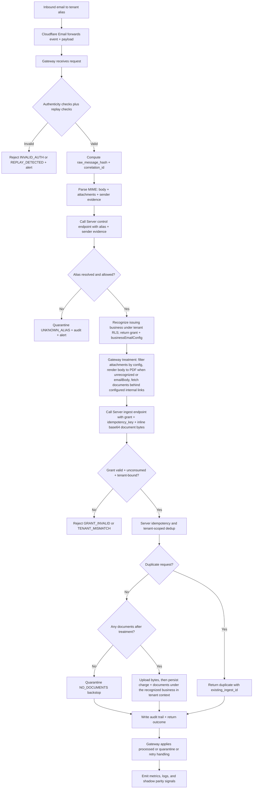

# Multi-tenant Email Ingestion Data Flow (v2)

This document visualizes the runtime data flow for the v2 Cloudflare -> Gateway -> Server
architecture.

During rollout, the current listener path remains active in parallel. This document focuses on the
new v2 ingestion path.

## End-to-End Flow



## Cloudflare-Gateway-Server Sequence

```mermaid
sequenceDiagram
    autonumber
    participant CF as Cloudflare Email
    participant GW as Gateway
    participant CTRL as Server Control API
    participant ING as Server Ingest API
    participant DB as Tenant Persistence
    participant QA as Quarantine and Audit

    CF->>GW: Forward event(recipient_alias, headers, raw payload)
    GW->>GW: Verify signature or mTLS + IP allowlist + timestamp window + nonce replay

    alt Invalid authenticity or replay
        GW->>QA: Record INVALID_AUTH or REPLAY_DETECTED + alert
        GW-->>CF: Reject
    else Valid request
        GW->>GW: Compute raw_message_hash + correlation_id
        GW->>GW: Parse MIME -> body + attachments + sender evidence
        GW->>CTRL: control(alias, message metadata, sender_evidence)

        alt Unknown alias or policy reject
            CTRL-->>GW: decision=reject, reason=UNKNOWN_ALIAS
            GW->>QA: Quarantine + alert
        else Grant issued
            CTRL->>CTRL: Resolve tenant; recognize issuing business (suggestion_data) under tenant RLS; bind business_id into grant
            CTRL-->>GW: tenant_id + decision_id + audit_id + ingest_grant + businessEmailConfig
            GW->>GW: Treatment: filter attachments, body->PDF (unrecognized or emailBody), fetch internal-link docs
            GW->>ING: ingest(ingest_grant, idempotency_key, documents + inline base64 bytes)
            ING->>ING: Validate grant scope + expiry + single-use jti

            alt Invalid or reused grant
                ING-->>GW: rejected(reason_code)
                GW->>QA: Quarantine or retry based on reason_code
            else Valid grant
                ING->>ING: Idempotency and tenant dedup

                alt Duplicate
                    ING-->>GW: duplicate(existing_ingest_id, audit_id)
                else No documents after treatment
                    ING->>QA: Quarantine NO_DOCUMENTS (backstop)
                    ING-->>GW: quarantined(reason_code, audit_id)
                else New insert
                    ING->>DB: Upload bytes; persist charge + documents under recognized business (tenant context)
                    DB-->>ING: ingest_id
                    ING-->>GW: inserted(ingest_id, audit_id)
                end
            end
        end
    end
```

## Data Contract Handoff

Control endpoint request includes:

1. recipient_alias
2. message_id
3. raw_message_hash
4. received_at
5. correlation_id
6. sender_evidence (from, reply_to, original_from, forwarded_to, and issuer candidates parsed from
   the body) — used server-side to recognize the issuing business

Control endpoint response includes:

1. tenant_id
2. decision_id and audit_id
3. ingest_grant with jti, tenant binding, action scope, and expires_at
4. businessEmailConfig — the recognized businessId plus its `emailBody`, `attachments`, and
   `internalEmailLinks` treatment config; null when no business matched

Ingest endpoint request includes:

1. ingest_grant
2. idempotency_key (the raw_message_hash)
3. tenant_id, message_id, raw_message_hash
4. extracted_documents — the **post-treatment** set, each with hash, size, mime_type, filename, and
   inline base64 content (Option B transport)
5. correlation_id

> `sender_evidence` travels on the **control** request (business recognition is server-side), not
> the ingest request. The ingest input never carries a client-settable `business_id` — the issuing
> business is read back from the grant, so the gateway cannot attribute documents to an arbitrary
> business.

Ingest endpoint response includes:

1. outcome (inserted, duplicate, quarantined, rejected)
2. ingest_id or existing_ingest_id
3. audit_id and reason_code for non-insert outcomes

## Failure and Control Loops

1. Invalid authenticity or replay detection: reject, alert, and audit.
2. Unknown alias or policy reject: quarantine and alert; ops updates alias policy.
3. Grant validation failure or tenant mismatch: reject or quarantine with audit trail.
4. Parse or size-limit failures (PARSE_ERROR, OVERSIZE_MESSAGE): quarantine with explicit
   reason_code. Document emptiness (NO_DOCUMENTS) is decided **after** treatment — the parse no
   longer fails a document-less message — with the server ingest as the backstop.
5. Transient upstream failures: scheduled retry; non-transient failures remain manual reprocess.
6. Shadow mode rollout: legacy path remains active while v2 decisions and outcomes are measured;
   parity is enforced by tests (see `treatment.parity.test.ts`).
