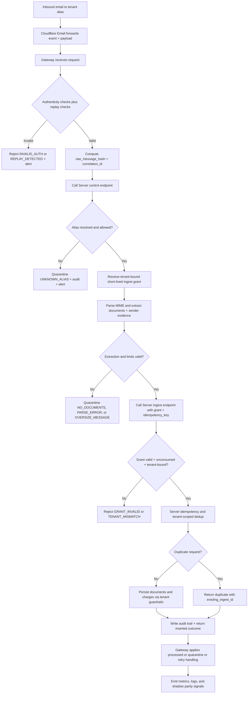
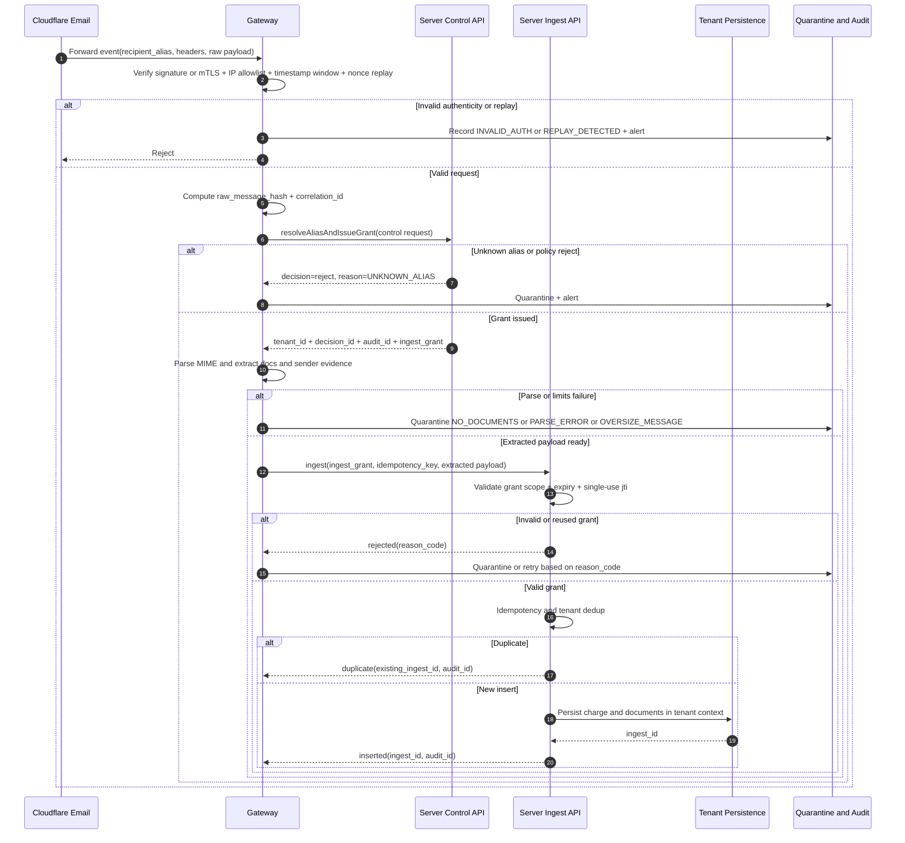

# Multi-tenant Email Ingestion Data Flow (v2)

This document visualizes the runtime data flow for the v2 Cloudflare -> Gateway -> Server
architecture.

During rollout, the current listener path remains active in parallel. This document focuses on the
new v2 ingestion path.

## End-to-End Flow

## Cloudflare-Gateway-Server Sequence

## Data Contract Handoff

Control endpoint request should include:

1. recipient_alias
2. provider_event_id, message_id, thread_id
3. envelope and from and to metadata
4. raw_message_hash
5. received_at
6. correlation_id

Control endpoint response should include:

1. tenant_id
2. decision_id and audit_id
3. ingest_grant with jti, scope, tenant binding, and expires_at
4. optional policy/profile metadata

Ingest endpoint request should include:

1. ingest_grant
2. idempotency_key
3. extracted_documents with hash, size, mime_type, filename, and parse result
4. sender_evidence (alias, from, reply_to, forwarding headers, issuer candidate)
5. message_metadata
6. correlation_id

Ingest endpoint response should include:

1. outcome (inserted, duplicate, quarantined, rejected)
2. ingest_id or existing_ingest_id
3. audit_id and reason_code for non-insert outcomes

## Failure and Control Loops

1. Invalid authenticity or replay detection: reject, alert, and audit.
2. Unknown alias or policy reject: quarantine and alert; ops updates alias policy.
3. Grant validation failure or tenant mismatch: reject or quarantine with audit trail.
4. Parse or size-limit failures: quarantine with explicit reason_code.
5. Transient upstream failures: scheduled retry; non-transient failures remain manual reprocess.
6. Shadow mode rollout: legacy path remains active while v2 decisions and outcomes are measured.
